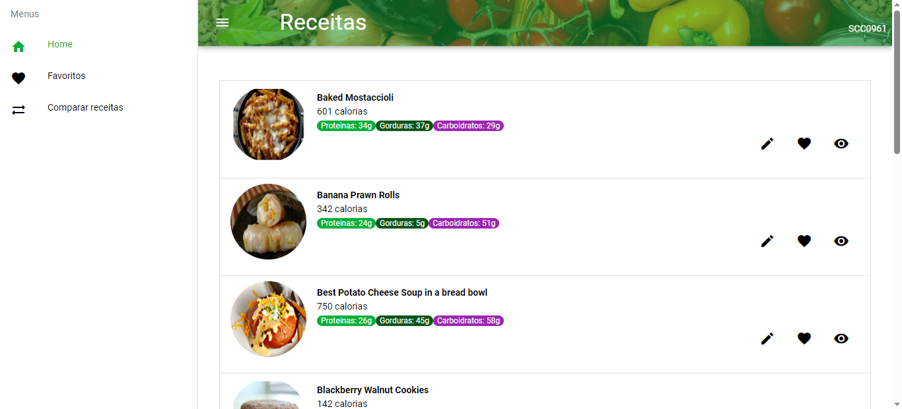

# Vue-Quasar Project

## Development

### Mock API with JSON Server

This repository provides a simple mock API setup using JSON Server. It allows you to create a mock API with minimal effort, making it convenient for frontend development and testing.

#### Getting Started

* Clone this repository to your local machine.

* Navigate to the 'server' folder inside the 'frontend-quasar' directory.

* Install the required dependencies by running the following command:

```bash
  npm install
```

* Install the JSON-server required dependencies by running the following command:

```bash
  npm install -g json-server
```

* After the installation is complete, start the JSON Server with the following command, within the folder *frontend-quasar/server*:

```bash
  json-server --watch db.json --port 4000
```



